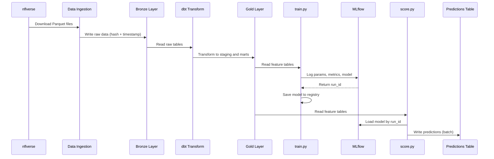

# Architecture Documentation

**Project**: endzone-mlops  
**Version**: 0.1.0  
**Last Updated**: 2026-10-06

## Overview

endzone-mlops demonstrates a modern lakehouse architecture for NFL analytics, combining Databricks (or Snowflake), dbt transformations, MLflow experiment tracking, and CI/CD automation.

**North Star**: Learning portfolio with production-shaped patterns. Batch-first analytics, not real-time streaming.

## C4 Model: Context (Level 1)

```
                                    NFL Fans / Data Scientists
                                              |
                                              | (views demos, explores data)
                                              v
                                    +-------------------+
                                    | endzone-mlops    |
                                    | NFL Lakehouse    |
                                    +-------------------+
                                              |
                          +-------------------+-------------------+
                          |                   |                   |
                          v                   v                   v
                 +-------------+     +---------------+    +--------------+
                 | nflverse    |     | Databricks    |    | GitHub       |
                 | (CC BY 4.0) |     | (or Snowflake)|    | Actions CI   |
                 +-------------+     +---------------+    +--------------+
                  Historical NFL           Compute              Automation
                  Play-by-Play           + Storage              + Testing
```

### External Systems

- **nflverse**: Public NFL data (play-by-play, games, players). CC BY 4.0 license. Historical only, not live.
- **Databricks Free Edition**: Primary lakehouse platform (or Snowflake trial as Plan B). Provides Delta Lake storage, serverless Spark compute, and MLflow tracking.
- **GitHub Actions**: CI/CD for linting, testing, and dbt compilation. Runs on every push and PR.
- **BALLDONTLIE** (future): Live NFL API for v0.2+. Documented but not active in v0.1.

### Users

- **Carlos Galvan**: Portfolio owner, demonstrates MLOps capabilities
- **Hiring Managers**: Evaluate DE/MLE/MLOps skills via README and demo
- **Data Scientists**: Can fork and adapt for other sports/domains

## C4 Model: Containers (Level 2)

```
+-------------------------------------------------------------------------+
|                         endzone-mlops System                            |
|                                                                         |
|  +-----------------+     +-----------------+     +------------------+  |
|  | Data Ingestion  |     | dbt Transform   |     | ML Pipeline      |  |
|  | (Python)        |---->| (SQL + Jinja)   |---->| (Python+MLflow)  |  |
|  +-----------------+     +-----------------+     +------------------+  |
|        |                        |                        |              |
|        | writes                 | reads/writes           | logs         |
|        v                        v                        v              |
|  +------------------------------------------------------------------+  |
|  |                    Databricks / Snowflake                        |  |
|  |  +-------------+  +-------------+  +-------------+  +---------+  |  |
|  |  | Bronze      |  | Silver      |  | Gold        |  | MLflow  |  |  |
|  |  | (raw data)  |->| (staging)   |->| (marts)     |  | Runs    |  |  |
|  |  +-------------+  +-------------+  +-------------+  +---------+  |  |
|  +------------------------------------------------------------------+  |
|                                                                         |
|  +------------------+           +--------------------+                  |
|  | GitHub Actions   |           | Notebooks          |                 |
|  | CI/CD            |           | (exploration only) |                 |
|  +------------------+           +--------------------+                  |
+-------------------------------------------------------------------------+
```

### Container Details

#### 1. Data Ingestion (`src/data/`)

**Technology**: Python (pandas, pyarrow)

**Responsibility**:
- Download nflverse Parquet files
- Validate checksums and schemas
- Load to bronze layer (raw, immutable)
- Implement HistoricalFeed interface

**v0.1 Scope**: Manual or scripted download of 1-3 seasons for development.

**Future (v0.2+)**: LiveFeed adapter for BALLDONTLIE API.

#### 2. dbt Transform (`dbt/`)

**Technology**: dbt-core, SQL, Jinja templates

**Responsibility**:
- **Staging** (`models/staging/`): Clean, standardized views of bronze data
- **Marts** (`models/marts/`): Business logic aggregations for features and analysis
- **Tests**: Data quality checks (uniqueness, nulls, accepted values, business rules)
- **Documentation**: Column descriptions, lineage graphs

**Layers**:
- `stg_nflverse__games`: Game-level data (schedule, scores, lines)
- `stg_nflverse__plays`: Play-by-play (future)
- `fct_pregame_features`: Features as-of kickoff (future)
- `fct_ingame_states`: Play-level states for in-game model (future)

#### 3. ML Pipeline (`src/models/`, `src/features/`)

**Technology**: Python, MLflow, scikit-learn/statsmodels

**Responsibility**:
- Feature engineering (rolling stats, team form, rest days)
- Model training (`train.py` with argparse + seed + hyperparameters)
- Experiment tracking (MLflow: params, metrics, artifacts, models)
- Batch scoring (`score.py` reads features, writes predictions)
- Evaluation (metrics: log loss, Brier score, calibration)

**v0.1 Scope**: Pregame win probability model (logistic regression baseline).

**Future**: In-game model, ensemble methods, drift monitoring.

#### 4. Delta Lake / Storage (Databricks/Snowflake)

**Technology**: Delta Lake (Databricks) or Snowflake tables

**Schema Layers**:
- **Bronze** (`bronze_*`): Raw data, immutable, with hash and ingestion timestamp
- **Silver** (`stg_*`, `silver_*`): Cleaned, standardized, type-safe
- **Gold** (`fct_*`, `dim_*`, `mart_*`): Aggregated features, predictions

**Benefits**:
- ACID transactions
- Time travel (Delta Lake)
- Schema evolution
- Efficient Parquet/columnar storage

#### 5. MLflow Tracking (Databricks/Local)

**Functionality**:
- **Experiments**: `nfl_pregame`, `nfl_ingame` (separate)
- **Runs**: Each training iteration with params, metrics, artifacts
- **Model Registry**: Versioned models with lineage
- **Artifacts**: Plots, feature importance, confusion matrices

**Access**:
- Databricks: Built-in UI
- Local: `mlflow ui` command

#### 6. GitHub Actions (`github/workflows/ci.yml`)

**Triggers**: Push, pull request

**Steps**:
1. Checkout code
2. Install dependencies
3. Lint (ruff)
4. Test (pytest)
5. dbt compile (validate SQL)
6. (Future) dbt build with test data

**Badge**: Shows CI status in README.

#### 7. Notebooks (`notebooks/`)

**Purpose**: Exploration and prototyping ONLY. Not part of production pipeline.

**Philosophy** (Wilson 9): Notebooks are for experimentation. Once patterns solidify, move to modular Python in `src/`.

## Data Flow (Sequence)



## Component Design Patterns

### Ports and Adapters (Future Live Feed)

**Interface**: `SportsFeed` protocol

```python
class SportsFeed(Protocol):
    def get_games(self, season: int, week: int) -> pd.DataFrame:
        """Fetch games for a given season and week."""
        ...
    
    def get_plays(self, game_id: str) -> pd.DataFrame:
        """Fetch plays for a specific game."""
        ...
```

**Implementations**:
- `HistoricalFeed` (nflverse): Reads Parquet from URLs or local cache
- `LiveFeed` (BALLDONTLIE): Polls API (v0.2+, requires auth)

**Benefit**: Train on historical, score on live, same code.

### Wilson Modularity (src/)

```
src/
├── data/
│   ├── feeds.py           # HistoricalFeed, LiveFeed interfaces
│   └── loaders.py         # Download and validation utilities
├── features/
│   ├── pregame.py         # Pregame feature engineering
│   └── ingame.py          # In-game feature engineering (future)
├── models/
│   ├── train.py           # Training script (argparse, MLflow)
│   └── score.py           # Batch scoring script
└── utils/
    ├── config.py          # Configuration loading
    └── logging.py         # Logging setup
```

**Principles**:
- Small, testable functions
- Config injected via argparse or env vars
- No logic in notebooks
- Entrypoints (`train.py`, `score.py`) orchestrate, not implement

### Schema Contracts

**dbt** (`schema.yml`):
- Column-level tests (unique, not_null)
- Business rules (e.g., `away_team != home_team`)
- Documentation for downstream users

**Python** (Pydantic):
- Config validation
- Type safety for features and predictions
- Fail fast on schema mismatches

## Deployment View

### Day 1-14: Development

- **Compute**: Databricks Free Edition serverless OR local DuckDB
- **Storage**: Databricks workspace OR local files
- **CI**: GitHub Actions (free tier)
- **MLflow**: Databricks managed OR local `./mlruns`

### Future (v0.2+): Scheduled Batch

- **Orchestration**: Databricks Jobs OR GitHub Actions schedule
- **Data refresh**: Daily nflverse pull + incremental dbt
- **Model retrain**: Weekly or on drift signal
- **Scoring**: Batch pregame predictions before kickoff

### NOT in Scope (v0.1)

- Kubernetes
- Streaming (Kafka, Kinesis)
- Real-time API (FastAPI)
- Feature store (Databricks/Feast)
- Multi-cloud

## Quality Attributes (ASRs)

### Reproducibility

**Requirement**: Any developer can clone repo and reproduce models.

**Implementation**:
- Pinned dependencies (`requirements.txt`)
- Seeds in MLflow runs
- Data provenance documented
- `make reproduce` command

### Modularity

**Requirement**: No logic in notebooks; all testable.

**Implementation**:
- Wilson patterns (see `QUALITY_GUIDELINES.md`)
- Pytest for pure functions
- dbt tests for SQL logic

### Honesty

**Requirement**: No fake production claims.

**Implementation**:
- Honesty banner in README
- "Learning portfolio" framing
- ADR documents spike and limitations

### Batch-First

**Requirement**: No real-time inference in v0.1.

**Implementation**:
- `score.py` writes to table, not API
- LiveFeed is stub
- "Eventual live" documented as roadmap

## Trade-offs

| Decision | Benefit | Cost |
|----------|---------|------|
| Databricks Free Edition over Snowflake | MLflow native, lakehouse narrative | Usage quotas (serverless-only, auto-stop) |
| dbt over Spark SQL scripts | Version control, testing, docs | Learning curve, compilation step |
| Batch scoring over API | Simpler for portfolio, reproducible | No demo of real-time inference |
| nflverse over live API | Free, CC BY 4.0, no secrets | Historical only; dual-vendor for live |
| DuckDB for local dev | Zero setup, fast | Not production-grade; switch for deployment |

## Security and Secrets

- **Never commit**: API keys, tokens, passwords, `.env` files
- **Use**: `.env.example`, `profiles.yml.example`, GitHub Secrets
- **dbt profiles**: Local file, never committed
- **Databricks token**: Environment variable, GitHub Secret

## Observability (Lite)

**Day 14 Scope**:
- Logging: Python `logging` module with timestamps
- One drift/quality signal: e.g., log prediction distribution to MLflow or `monitoring_*` table

**Future**:
- Drift detection (PSI, KS test)
- Data quality dashboards (Great Expectations + dbt tests)
- Alerting (Slack, email on drift)

## References

- [ADR-001](adr/ADR-001-databricks.md): Stack decision
- [Runbook](runbook.md): Operational procedures
- [QUALITY_GUIDELINES.md](../QUALITY_GUIDELINES.md): Engineering standards
- dbt Best Practices: https://docs.getdbt.com/guides/best-practices
- MLflow Tracking: https://mlflow.org/docs/latest/tracking.html
- Databricks Lakehouse: https://databricks.com/product/delta-lake-on-databricks

---

**Diagrams**: ASCII art and Mermaid for portability. Can generate PNG with Mermaid CLI for presentations.

**Maintenance**: Update this document when ASRs change or architecture evolves.
